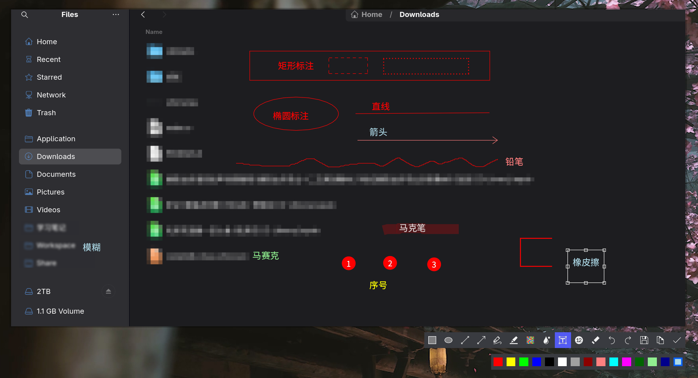

# Annotator

> 🎨 一个简洁强大的图片标注和贴图工具，为 Linux Wayland 环境优化设计


## 📋 项目介绍

**Annotator** 是一款用 Rust 语言编写的高性能图片标注和贴图工具，专为 Linux Wayland 显示服务器优化。该工具支持快速标注图片、添加贴图和注释，提供高效的工作流和直观的用户界面。

## ✨ 主要特性

- 🖼️ **图片标注** - 支持多种标注工具(例如：矩形、椭圆、直线、箭头、铅笔、马克笔、马赛克、模糊、文本、序号、橡皮擦等)和功能
- 🏷️ **灵活的贴图系统** - 快速添加和管理贴图元素
- 🐧 **Wayland 原生支持** - 为 Linux Wayland 环境深度优化
- ⚡ **高性能** - 使用 Rust 实现，确保快速响应和低资源占用
- 🎯 **用户友好** - 直观的界面设计，易于上手

## 🚀 快速开始

### 前置要求

- Rust 1.70 或更高版本
- Linux 系统（仅支持使用 Wayland 显示服务器）
- Wayland 相关开发库

### 安装

#### 从源代码构建

```bash
git clone https://github.com/FengZhongShaoNian/annotator.git
cd annotator
cargo build --release
```
构建完成后，可执行文件位于 target/release/annotator

### 运行

```bash
./annotator /path/to/your/image.png
```

建议搭配[screenshot](https://github.com/FengZhongShaoNian/screenshot)工具一起使用，可以实现一键截图并标注：

```shell
#!/bin/bash

mkdir -p /tmp/screenshot-sticky
time=$(date "+%Y%m%d-%H-%M-%S")
tmp_file="/tmp/screenshot-sticky/${time}.png"
# 使用screenshot工具进行截图并将图片保存到指定的路径
/path/to/screenshot "$tmp_file"
# 截图工具在截图过程中会在用户目录中生成一个screenshot.png文件，可以删掉它以避免污染用户目录
rm ${HOME}/screenshot.png
# 使用annotator对图片进行标注
/path/to/annotator "$tmp_file"

```

如果使用GNOME，建议搭配[annotator-gnome-extension](https://github.com/FengZhongShaoNian/annotator-gnome-extension)这个Gnome插件一起使用，这个插件提供窗口置顶和在dash-to-panel的任务栏中隐藏annotator窗口图标的功能。

#### 使用AUR安装

对应使用Archlinx的用户，可以使用如下命令来安装：
```shell
paru -S image-annotator-git
# or
yay -S image-annotator-git
```

### 截图



🤝 贡献

欢迎提交 Issue 和 Pull Request！如果你有改进建议或发现了 Bug，请随时联系我们。

感谢你对 Annotator 的关注！💝